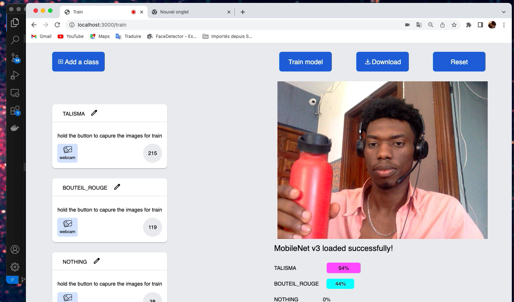

## Student Attendance Management System for school
A College Attendance Management System

Biometric face tracking attendance **Web App** for tracking and verifying employee’s or student’s attendance using their unique facial characteristics

### Checklist Features

- [x] train the neural network with a camera
- [x] download the neural network model
    - [x] save it in server by http request
- [x] add new classes to model
- [x] load downloaded the model
    - [ ] **load the model fully offline**
- [x] reset train 
    - [x] (re-train model)
- [ ] setup the real time database
    - [ ] captures the instant the class was detected
    - [ ] save the instant the class was detected (update in DB)
- [x] a UI based on the teachable machine

